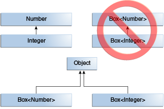
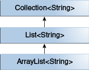
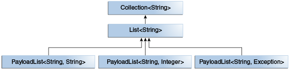
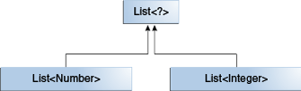
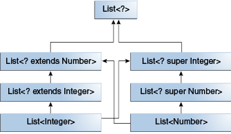

# Generyki

### Przyczyny

- [ ]  Kontrola w czasie kompilacji
- [ ]  Eliminacja rzutowania

```java
List list = new ArrayList();
list.add("hello");
String s = (String) list.get(0);
list.add(1) //allowed

List<String> list = new ArrayList<String>();
list.add("hello");
String s = list.get(0);   // no cast
list.add(1) //compilation error
```

### Typy generyczne

- [ ]  Deklaracja typu generycznego

```java
class name<T1, T2, ..., Tn> { /* ... */ }
```

- [ ]  Przykład podstawowego typu generycznego

```java
/**
 * Generic version of the Box class.
 * @param <T> the type of the value being boxed
 */
public class Box<T> {
    // T stands for "Type"
    private T t;

    public void set(T t) { this.t = t; }
    public T get() { return t; }
}
```

- [ ]  Typ T może być dowolnym typem (byle nie prymitywnym)
- [ ]  Standardowe nazwy typów

```java
E - Element (used extensively by the Java Collections Framework)
K - Key
N - Number
T - Type
V - Value
S,U,V etc. - 2nd, 3rd, 4th types
```

- [ ]  Tworzenie instancji i diamond operator

```java
Box<Integer> integerBox = new Box<Integer>();
Box<Integer> integerBox = new Box<>();
```

- [ ]  Typy wieloparametrowe

```java
public interface Pair<K, V> {
    public K getKey();
    public V getValue();
}

public class OrderedPair<K, V> implements Pair<K, V> {

    private K key;
    private V value;

    public OrderedPair(K key, V value) {
	    this.key = key;
	    this.value = value;
    }

    public K getKey()	{ return key; }
    public V getValue() { return value; }
}
```

- [ ]  Typy można zagnieżdżać

```java
OrderedPair<String, Box<Integer>> p = new OrderedPair<>("primes", new Box<Integer>(...));
```

### Typy surowe (raw)

- [ ]  Istnieją w celu kompatybilności wstecznej (stare biblioteki + zacieranie typów)
- [ ]  Generują ostrzeżenia

```java
Box<String> stringBox = new Box<>();
Box rawBox = stringBox;               // OK

Box rawBox = new Box();           // rawBox is a raw type of Box<T>
Box<Integer> intBox = rawBox;     // warning: unchecked conversion

Box<String> stringBox = new Box<>();
Box rawBox = stringBox;
rawBox.set(8);  // warning: unchecked invocation to set(T)
```

### Metody generyczne

- [ ]  Dozwolone statyczne, niestatyczne i konstruktory
- [ ]  Typ generyczny jest widoczny tylko wewnątrz metody

```java
public class Util {
    public static <K, V> boolean compare(Pair<K, V> p1, Pair<K, V> p2) {
        return p1.getKey().equals(p2.getKey()) &&
               p1.getValue().equals(p2.getValue());
    }
}

@Getter
@Setter
public class Pair<K, V> {

    private K key;
    private V value;

    //omitted for brevity
}
```

- [ ]  Sposoby wywołania

```java
Pair<Integer, String> p1 = new Pair<>(1, "apple");
Pair<Integer, String> p2 = new Pair<>(2, "pear");
boolean same = Util.<Integer, String>compare(p1, p2); //rarely used
boolean same = Util.compare(p1, p2); //usually used, types inferred

```

### Typ wywnioskowany (inferred)

- [ ]  Jeżeli kompilator potrafi "wywnioskować" jaki typ generyka jest niezbędny by kod miał sens to można go pominąć (patrz przykład wyżej)
- [ ]  Na podobnej zasadzie działa diamond operator
- [ ]  Do wywnioskowania niekoniecznie są potrzebne argumenty metody, kompilatorowi wystarczy też typ wynikowy:

```java
//from Collections class
static <T> List<T> emptyList();

....

List<String> listOne = Collections.emptyList(); //NOTE: will not work in Java 7
```

- [ ]  Czasami wnioskowanie nie działa poprawnie (np. przy bezparametrowych metodach statycznych) - wtedy niezbędne jest wymuszenie typu w zawołaniu metody

```java
var l1 = List.of() // List<Object>
var l2 = List.<String>of() // List<String>

```

- [ ]  Uwaga na pułapkę z konstruktorem

```java
//poprawnie ale rozwlekle
Map<String, List<String>> myMap = new HashMap<String, List<String>>(); 

//dalej poprawnie ale zwiezle
Map<String, List<String>> myMap = new HashMap<>();

//zle - stworzy sie typ surowy
Map<String, List<String>> myMap = new HashMap(); // unchecked conversion warning
```

### Typy uwiązane (bounded) jako parametry

- [ ]  Pozwalają na założenie że dany parametr ma konkretny nadtyp

```java
public class NaturalNumber<T extends Integer> {

    private T n;

    public NaturalNumber(T n)  { this.n = n; }

    public boolean isEven() {
        return n.intValue() % 2 == 0; //bez bounded type by się nie dało
    }

    // ...
}
```

- [ ]  Niepoprawny typ spowoduje błąd kompilacji

```java
NaturalNumber<String> n = new NaturalNumber<>("A"); //error !
```

- [ ]  Multiple bounds

```java
<T extends B1 & B2 & B3>
```

- [ ]  Typy uwiązane umożliwiają implementację algorytmów generycznych

```java
//Bez uwiązania
public static <T> int countGreaterThan(T[] anArray, T elem) {
    int count = 0;
    for (T e : anArray)
        if (e > elem)  // compiler error
            ++count;
    return count;
}

//Z uwiązaniem
public static <T extends Comparable<T>> int countGreaterThan(T[] anArray, T elem) {
    int count = 0;
    for (T e : anArray)
        if (e.compareTo(elem) > 0)
            ++count;
    return count;
}
```

### Generyki a dziedziczenie typów

- [ ]  Typowa pułapka



- [ ]  Dlaczego tak się dzieje ?

```java
Integer i = 7;
Box<Integer> intBox = new Box<>(i);
Box<Number> numBox = intBox; //załóżmy, że tak się jednak da
Number n = 2.0; //Double
numBox.set(n); //ClassCastException, próba wpisania Double pod Integer
```

- [ ]  Uwaga - z tablicami jest inaczej

```java
Integer i = 7;
Integer[] intArr = new Integer[] {i};
Number[] numArr = intArr; //kompiluje się bez problemu... do czasu :)
Number n = 2.0; //Double
numArr[0] = n; //ArrayStoreException
```

- [ ]  Przy tym samym typie jako parametrze dziedziczenie jak najbardziej działa



```java
ArrayList<String> arrList = new ArrayList<>();
List<String> list = arrList;
```

- [ ]  Można też rozszerzyć typ generyczny dodając nowy parametr

```java
interface PayloadList<E,P> extends List<E> {
  void setPayload(int index, P val);
  ...
}
```



### Zacieranie typów

- [ ]  Standardowo do typu Object, chyba że typ jest uwiązany
- [ ]  Ale UWAGA! - w bytecode (View -> Show Bytecode) kompilator pozostawia tzw. sygnatury -> informacje dla debuggera i dekompilatora.
- [ ]  NIE można ich jednak wykorzystać w runtime do odzyskania typu użytego w generyku - nawet za pomocą refleksji: [https://stackoverflow.com/questions/1942644/get-generic-type-of-java-util-list](https://stackoverflow.com/questions/1942644/get-generic-type-of-java-util-list)

```java
package com.chrosciu;

public class SimpleBox {
    Object elem;

    public Object getElem() {
        return elem;
    }
}
```

```
// class version 55.0 (55)
// access flags 0x21
public class com/chrosciu/SimpleBox {

        // compiled from: SimpleBox.java

        // access flags 0x0
        Ljava/lang/Object; elem

// access flags 0x1
public <init>()V
        L0
        LINENUMBER 3 L0
        ALOAD 0
        INVOKESPECIAL java/lang/Object.<init> ()V
        RETURN
        L1
        LOCALVARIABLE this Lcom/chrosciu/SimpleBox; L0 L1 0
        MAXSTACK = 1
        MAXLOCALS = 1

// access flags 0x1
public getElem()Ljava/lang/Object;
        L0
        LINENUMBER 7 L0
        ALOAD 0
        GETFIELD com/chrosciu/SimpleBox.elem : Ljava/lang/Object;
        ARETURN
        L1
        LOCALVARIABLE this Lcom/chrosciu/SimpleBox; L0 L1 0
        MAXSTACK = 1
        MAXLOCALS = 1
        }
```

```java
package com.chrosciu;

public class GenericSimpleBox<T> {
    T elem;

    public T getElem() {
        return elem;
    }
}
```

```
// class version 55.0 (55)
// access flags 0x21
// signature <T:Ljava/lang/Object;>Ljava/lang/Object;
// declaration: com/chrosciu/GenericSimpleBox<T>
public class com/chrosciu/GenericSimpleBox {

        // compiled from: GenericSimpleBox.java

        // access flags 0x0
        // signature TT;
        // declaration: elem extends T
        Ljava/lang/Object; elem

// access flags 0x1
public <init>()V
        L0
        LINENUMBER 3 L0
        ALOAD 0
        INVOKESPECIAL java/lang/Object.<init> ()V
        RETURN
        L1
        LOCALVARIABLE this Lcom/chrosciu/GenericSimpleBox; L0 L1 0
        // signature Lcom/chrosciu/GenericSimpleBox<TT;>;
        // declaration: this extends com.chrosciu.GenericSimpleBox<T>
        MAXSTACK = 1
        MAXLOCALS = 1

// access flags 0x1
// signature ()TT;
// declaration: T getElem()
public getElem()Ljava/lang/Object;
        L0
        LINENUMBER 7 L0
        ALOAD 0
        GETFIELD com/chrosciu/GenericSimpleBox.elem : Ljava/lang/Object;
        ARETURN
        L1
        LOCALVARIABLE this Lcom/chrosciu/GenericSimpleBox; L0 L1 0
        // signature Lcom/chrosciu/GenericSimpleBox<TT;>;
        // declaration: this extends com.chrosciu.GenericSimpleBox<T>
        MAXSTACK = 1
        MAXLOCALS = 1
        }
```

- [ ]  Przy zacieraniu typu czasami kompilator musi "po cichu" wygenerować metody pomostowe (bridge methods)

```java
//Before erasure:
public class MyComparator implements Comparator<Integer> {
   public int compare(Integer a, Integer b) {
      //
   }
}

//After erasure:
public class MyComparator implements Comparator {
   //does not implement Comparator interface
   public int compare(Integer a, Integer b) {
      //
   }
   //bridge method is needed
   //NOTE: access to this method is blocked by compiler !
   public int compare(Object a, Object b) {
      return compare((Integer)a, (Integer)b);
   }
}
```

### Wildcard (brak dobrego polskiego tłumaczenia) - znak ?

- [ ]  Oznacza nieznany typ w typie generycznym
- [ ]  Uwiązany z góry (upper bounded) - pozwala na złagodzenie ograniczeń przy odczycie danych z typu generycznego (extends także przy interfejsach)

```java
public static double sumOfList(List<? extends Number> list) {
    double s = 0.0;
    for (Number n : list)
        s += n.doubleValue();
    return s;
}

//we can pass here List<Number>, List<Integer>, List<Double>, etc.
```

- [ ]  Uwiązany z dołu (lower bounded) - pozwala na złagodzenie ograniczeń przy zapisie danych do typu generycznego

```java
public static void addNumbers(List<? super Integer> list) {
    for (int i = 1; i <= 10; i++) {
        list.add(i);
    }
}

//we can pass here List<Object>, List<Number>, List<Integer>
```

- Nie istnieje możliwość założenia uwiązania jednocześnie z dołu i z góry

- [ ]  Nieuwiązany (unbounded) - używany gdy wyłącznie czytamy z typu generycznego i korzystamy z metod typu Object, lub też wykonujemy operację nie wymagającą w ogóle odczytu danych (np. List.clear()).

```java
public static void printList(List<?> list) {
    for (Object elem: list)
        System.out.print(elem + " ");
    System.out.println();
}
```

- List<?> to tak naprawdę List<? extends Object>
- List<?> to coś zupełnie innego niż List<Object> - do tej pierwszej można wstawić tylko wartości null, do drugiej dowolny obiekt
- List<?> to nie to samo to co List  - druga nie zapewnia żadnej kontroli nad typami

- [ ]  Hierarchia typów z wildcardami:





```java
//Proof that generic types and raw ones are equivalent - compiles without any errors
static void foo(List<Number> list) {
    bar(list);
}

static void fooLower(List<? super Number> list) {
    bar(list);
}

static void fooUpper(List<? extends Number> list) {
    bar(list);
}

static void fooUnbounded(List<?> list) {
    bar(list);
}

static void bar(List list) {
    foo(list);
    fooLower(list);
    fooUpper(list);
    fooUnbounded(list);
}

```

- [ ]  Wskazówki stosowania wildcardów:

- Jeśli czytamy z generyka - upper bounded
- Jeśli piszemy do generyka - lower bounded
- Jeśli czytamy z generyka i wystarczą nam metody klasy Object - unbounded
- Jeśli i czytamy z i piszemy do generyka - nie stosujemy wildcarda
- Wildcardy nie powinny być zwracane jako wynik metody

### Ograniczenia

- [ ]  Nie można używać typów prymitywnych

```java
Pair<int, char> p = new Pair<>(8, 'a');  // compile-time error
Pair<Integer, Character> p = new Pair<>(8, 'a');  // OK, BTW: autoboxing used
```

- [ ]  Nie można stworzyć instancji parametru

```java
public static <E> void append(List<E> list) {
    E elem = new E();  // compile-time error
    list.add(elem);
}

//Workaround - pass class
public static <E> void append(List<E> list, Class<E> cls) throws Exception {
    E elem = cls.newInstance();   // OK
    list.add(elem);
}

List<String> ls = new ArrayList<>();
append(ls, String.class);
```

- [ ]  Nie można tworzyć statycznych pól o typie parametru

```java
public class MobileDevice<T> {
    private static T os; // compile-time error

    // ...
}

MobileDevice<Smartphone> phone = new MobileDevice<>();
MobileDevice<Pager> pager = new MobileDevice<>();
MobileDevice<Tablet> pc = new MobileDevice<>();
//what is the type of os - Smarthpone, Pager, Tablet ?

```

- [ ]  Nie można stosować instanceof (wyjątek - unbunded wildcard, jako reifiable type)

```java
public static <E> void rtti(List<E> list) {
    if (list instanceof ArrayList<Integer>) {  // compile-time error
        // ...
    }
}

public static void rtti(List<?> list) {
    if (list instanceof ArrayList<?>) {  // OK; instanceof requires a reifiable type
        // ...
    }
}
```

- [ ]  Nie można tworzyć tablic typów generycznych (powód - niemożność wykrycia niepoprawnego typu w runtime)

```java
List<Integer>[] arrayOfLists = new List<Integer>[2];  // compile-time error
...
Object[] strings = new String[2];
strings[0] = "hi";   // OK
strings[1] = 100;    // An ArrayStoreException is thrown.

...
Object[] stringLists = new List<String>[2];  // zalozmy ze sie da
stringLists[0] = new ArrayList<String>();   // OK
stringLists[1] = new ArrayList<Integer>();  // Powinien poleciec ArrayStoreException, ale nie da sie go wykryc
```

- [ ]  @SafeVarargs

[Possible heap pollution via varargs parameter](https://stackoverflow.com/questions/12462079/possible-heap-pollution-via-varargs-parameter#)

- [ ]  Typ generyczny nie może dziedziczyć po Throwable (wprost i nie wprost)

```java
// Extends Throwable indirectly
class MathException<T> extends Exception { /* ... */ }    // compile-time error

// Extends Throwable directly
class QueueFullException<T> extends Throwable { /* ... */ // compile-time error
```

- [ ]  Nie można łapać wyjątku o typie będącym parametrem

```java
public static <T extends Exception, J> void execute(List<J> jobs) {
    try {
        for (J job : jobs)
            // ...
    } catch (T e) {   // compile-time error
        // ...
    }
}
```

- [ ]  Nie można tworzyć przeciążonych metod, które po zatarciu typów staną się niejednoznaczne

```java
public class Example {
    public void print(Set<String> strSet) { }
    public void print(Set<Integer> intSet) { }
}
```

### Zadania

1. Stworzyć generyczną klasę `Pair<T, U>` reprezentującą parę dwóch obiektów: `first` o typie `T` i `second` o typie`U`. W podstawowej wersji wyposażyć ją w konstruktor przyjmujący obie składowe pary oraz gettery do obu pól.
2. Stworzyć klasę `PairUtils`, będącą klasą oferującą publiczne statyczne metody użytkowe pracujące na klasie `Pair`.
3. W klasie `PairUtils` zaimplementować metodę `Pair swap(Pair)` zwracającą nową parę powstającą przez zamianę pierwszego pola danej pary z drugą (np. `swap(Pair(4, "A"))` powinno zwrócić `Pair(A, "4")`).
4. W klasie `PairUtils` zaimplementować metodę `void addToMap(Pair, Map)`,która to metoda powinna dołożyć nowy wpis do mapy podanej jako drugi argument. Kluczem powinno być pierwsze pole pary, wartością - drugie.
5. W klasie `PairUtils` zaimplementować metodę `V combine(Pair, BiFunction)`, która powinna pozwolić na zastąpienie podanej pary wartością zwróconą przez zawołanie funkcji (będącej drugim argumentem) dla obu elementów pary (tzw. fold / reduce). Metoda ma zwracać obiekt typu `V`, który to również ma podlegać generyfikacji tak samo jak `T` i `U`
6. W klasie `Pair` zai[](https://)mplementować metodę `equals(Pair)` (**UWAGA**: to nie jest metoda odziedziczona z klasy `Object`) zwracającą `true` jeżeli para przekazana jako argument jest równa parze na której zawołano metodę i `false` w przeciwnym wypadku. Pary `p1` i `p2` traktujemy jako równe jeżeli dla ich pól zachodzi równość `p1.first.equals(p2.first)` oraz `p1.second.equals(p2.second)`
7. W klasie `Pair` zaimplementować metodę `equals(Object)` (odziedziczoną z klasy `Object`), wykorzystując metodę `equals(Pair)` napisaną w poprzednim punkcie. Działanie ma być następujące - jeżeli `Object` nie jest typu `Pair` od razu zwracamy `false`; w przeciwnym wypadku - wołamy metodę `equals(Pair)` i zwracamy jej wynik. Nadpisać również metodę `int hashCode()` tak aby zachować wymagany kontrakt z klasy `Object`
8. ~~Zmodyfikować klasę `Pair` tak aby implementowała interfejs `Comparable`. W celu ustalenia wyniku porównania dwóch par, porównać najpierw ich pierwsze elementy i jeżeli nie są one równe zwrócić wynik tego porównania. W przeciwnym wypadku zwrócić wynik porównania drugich elementów.~~
9. Zmodyfikować za pomocą wildcardów wszystkie metody stworzone we wcześniejszych punktach, tak aby zapewnić maksymalną elastyczność ich używania - np. powinno być możliwe skompilowanie takiego kodu:

```java
Pair<Integer, Double> p1 = new Pair<>(3, 7.0);
Map<Number, Number> map = new HashMap<>();
PairUtils.addToMap(p1, map);
```

### Rozwiązanie zadań

```java
public class Pair<T extends Comparable<T>, U extends Comparable<U>> implements Comparable<Pair<? extends T, ? extends U>> {
    private final T first;
    private final U second;

    public T getFirst() {
        return first;
    }

    public U getSecond() {
        return second;
    }

    public Pair(T first, U second) {
        this.first = first;
        this.second = second;
    }

    public boolean equals(Pair<?, ?> other) {
        return this.first.equals(other.first) && this.second.equals(other.second);
    }

    @Override
    public boolean equals(Object o) {
        return o instanceof Pair<?, ?> && this.equals((Pair<?, ?>) o);
    }

    @Override
    public int hashCode() {
        return this.first.hashCode() + this.second.hashCode();
    }

    @Override
    public int compareTo(Pair<? extends T, ? extends U> other) {
        int firstCompareResult = other.first.compareTo(this.first);
        return firstCompareResult != 0 ? firstCompareResult : other.second.compareTo(this.second);
    }
}

class PairUtils {
    public static <T extends Comparable<T>, U extends Comparable<U>> Pair<U, T> swap(Pair<? extends T, ? extends U> pair) {
        return new Pair<>((U)(pair.getSecond()), (T)(pair.getFirst()));
    }

    public static <T extends Comparable<T>, U extends Comparable<U>> void addToMap(Pair<? extends T, ? extends U> pair, Map<? super T, ? super U> map) {
        if (map.containsKey(pair.getFirst())) {
            throw new IllegalStateException("Key already present");
        }
        map.put(pair.getFirst(), pair.getSecond());
    }

    public static <T extends Comparable<T>, U extends Comparable<U>, V> V combine(Pair<? extends T, ? extends U> pair, BiFunction<? super T, ? super U, ? extends V> combiner) {
        return combiner.apply(pair.getFirst(), pair.getSecond());
    }
}
```
